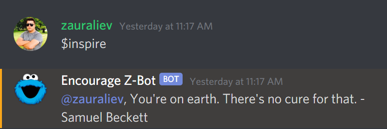
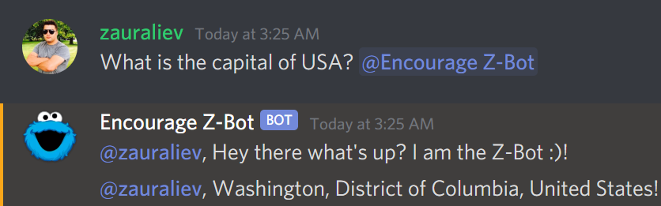

# (Node.js) z-discord-bot

🤖 **Z-Bot is a Discord bot which will inspire users and answer simple user questions.**

### Z-Bot for Discord Channel

[Add Z-Bot into your Discord Channel](https://discord.com/oauth2/authorize?client_id=825903337274081310&scope=bot).

### Quotes API for ($inspire)

See [https://zenquotes.io/api](https://zenquotes.io/api).

### Wolfram API for (Bot's short answers)

See [https://products.wolframalpha.com/api/](https://products.wolframalpha.com/api/).

